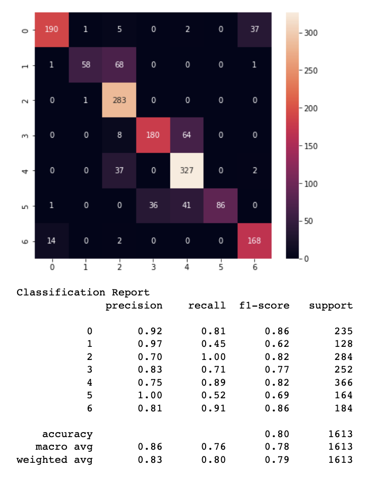

# Gesture-Controlled Special Effects

Inspired by the movie Dr. Strange to create special effects that are triggered by gestures. This project contains two main components: 
1) tune a pre-trained model to recognize desired gestures.
2) render video frames captured by OpenCV with special effects.

## Gesture Recognition CNN Model
I modified a pre-existing model to detect finger landmarks, and trained our finger point coordinate data on the CNN. 

## Special Effects
I implemented seven special effects that could be triggered by gestures during video renderation. Our model would be able to recognize seven gestures: zero, one, two, three (ok), four, five, and six ("yolo" gesture). The following chart shows our recognition accuracy for each gesture.

### *Point Art Filter*

I preprocessed the video frames by applying a low pass filter and determined the ten main colors of the image. Finally, I looped through the clusters of pixels in the video frame, painting a dot in the color that most represents that current cluster of pixels 

### *Segmentation*

I utilize 2 different segmentation models, MediaPipe Selfie Segmentation (based on MobileNetV3) and a pre-trained semantic segmentation model (PSPNet), to segment frames from the video stream. Color maps, masks, and Numpy functions were then used to be able to shift the segmented image around the real-time video stream.

### *Cartoon*

I use a bilateral filter to smooth the colors and whittle down the gradients, then used edge detection for dark, thick borders that replicate line art in animations and cartoons. 

### *Panorama*

Took a panorama picture, then displayed a subset of it. Panning around the width subset gives off the illusion that a person is turning in a room as they shift along with the image. 

### *Mural*

For this section, an image stylization model from Magenta was used to transfer style and color from a different image to the live camera feed. This model was designed to be used on arbitrary images, and so I was able to successfully conduct style transfer on most elements that could be provided in the camera frame, instead of being limited to specific items. 

### *Drawing*

The drawing effect is implemented through the OpenCV library. The model records the point history of the index finger. Based on the coordinates, I apply OpenCV to draw lines on an empty canvas, denoted by an array of zeros, and combine the canvas with the video frame image. 

### *Light tunnel*

The light tunnel effects track the hand as the center and use a NumPy identity map to project the pixels outside the center circle into radiating lines.

## Reference

[1] Hong Liu. Create Pointillism Art from Digital Images. https://web.stanford.edu/class/ee368/Project_Autumn_1516/Reports/Hong_Liu.pdf

[2] TensorFlow Neural Style Transfer
https://www.tensorflow.org/lite/examples/style_transfer/overview

[3] Image Segmentation. https://github.com/divamgupta/image-segmentation-keras